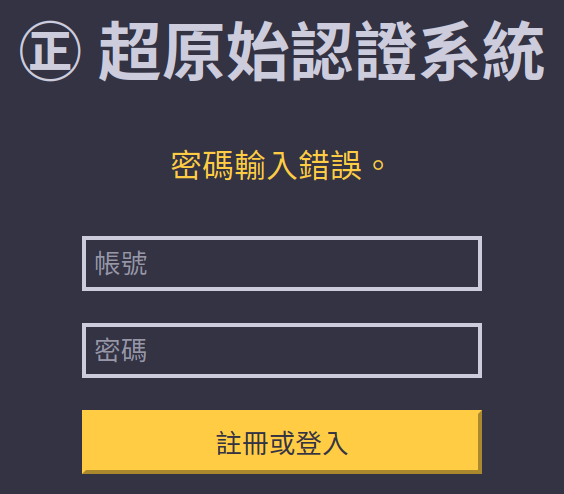

# ㊣ 超原始認證系統

## 這啥

不採用任何 PHP 框架所製作的帳號註冊、登入系統。

目前功能如下：

* 帳號、密碼格式檢查
* 註冊帳號
* 登入帳號
* 登出帳號
* 觀看伺服器 PHP 版本 (?)

## 螢幕擷圖





## 系統需求

* PHP 7~8
* MySQL 5~8
* `專案路徑/storage/sessions` 需有寫入權限

## 安裝

```shell
git clone git@github.com:willy08wu07/primitive-auth-system-demo.git
cd primitive-auth-system-demo/public # 重要：務必先進入 public 目錄再啟動網頁伺服器！
php -S 127.0.0.1:8000
```

然後即可瀏覽 <http://localhost:8000/> 。

MySQL 伺服器請自備，並請將連線資訊及帳號填入到 `DatabaseConfig.php` 。資料庫需事先手動建立，但資料表會由本專案自動建立。

## 已知問題

Q：F5 會彈出瀏覽器的詢問訊息，說必須重新傳送 $%!^*& 才能顯示此網頁？  
A：這個若要解決會蠻麻煩（花時間）的，既然這只是展示性質的專案就先不管。

Q：有安全漏洞嗎？  
A：有 [session fixation](https://en.wikipedia.org/wiki/Session_fixation) 和 [cross-site request forgery](https://zh.wikipedia.org/zh-tw/%E8%B7%A8%E7%AB%99%E8%AF%B7%E6%B1%82%E4%BC%AA%E9%80%A0) ，所以請不要完全照抄學去做什麼重要的專案喔。
